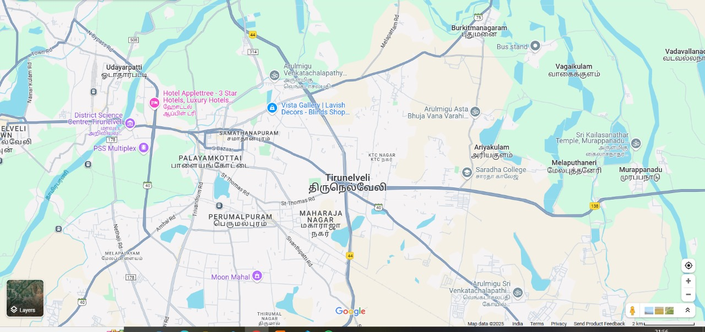

# Ex04 Places Around Me
## Date: 23.04.2025

## AIM
To develop a website to display details about the places around my house.

## DESIGN STEPS

### STEP 1
Create a Django admin interface.

### STEP 2
Download your city map from Google.

### STEP 3
Using ```<map>``` tag name the map.

### STEP 4
Create clickable regions in the image using ```<area>``` tag.

### STEP 5
Write HTML programs for all the regions identified.

### STEP 6
Execute the programs and publish them.

## CODE
```python

my.html

<html>
    <head>
        <title>My City</title>
    </head>
    <body>
        <h1 align="center">
            <font color="red"><b>TIRUNELVELI</b></font>
        </h1>
        <h3 align="center">
            <font color="blue"><b>THARSHINI M (212224230287)</b></font>
        </h3>
        <center>
            
            <map name="MyCity">
                <area shape="poly" coords="423,585,422,520,524,512,533,578" title="mahal" href="mahal.html">
                <area shape="poly" coords="249,165,445,139,272,232,415,213,377,468,496,457,473,538,378,520,825,284,938,289,938,345,825,327" title="College" href="college.html">
                <area shape="poly" coords="891,159,968,152,974,213,891,223" title="temple" href="temple.html">

            </map>
        </center>  
    </body>
</html>

```
```python 

temple.html

<html>
    <head>
        <title>My City</title>
    </head>
    <body>
        <h1 align="center">
            <font color="red"><b>TIRUNELVELI</b></font>
        </h1>
        <h2 align="center">
            <font color="green"><b>Temple</b></font>
        </h2>
        <br>
        <hr size="3" color="yellow">
        <br>
        <center>
        </center>
        <p align="justify">
            <font face="Georgia" size="5" color="black">
                This temple is located near Sri Sarada College of Education Rani Mangammal Road, Melakulam 627351, Tirunelveli, Tamil nadu. This is the first temple exclusive for Varahi Amman in Tirunelveli, Thoothukodi and Virudhunagar District with separate dwajasthambam, Balipeedam and Shimavaham in front of Varahi Amman. This is also the Second temple exclusive for Varahi Amman in Tamil Nadu after Thiru Uthirukosamangai, Ramanad Dist, This is also third temple in India after Kasi and Thiru Uthirakosamangai with the unique features said above. This temple Karuvarai is intersecting 77 deg. of East Longitude and 8 deg. of North Latitude. The earth Equator(Boomathya regai) is also crossing this Temple Karuvarai.
            </font>
        </p>
    </body>
</html>
```
```python

mahal.html

<html>
    <head>
        <title>My City</title>
    </head>
    <body>
        <h1 align="center">
            <font color="red"><b>TIRUNELVELI</b></font>
        </h1>
        <h2 align="center">
            <font color="green"><b>Moon Mahal</b></font>
        </h2>
        <br>
        <hr size="3" color="yellow">
        <br>
        <center>
        </center>
        <p align="justify">
            <font face="Georgia" size="5" color="black">
                "A New Destination for Marriages & Events in Tirunelveli, with a capacity of 1000 People & Bespoke Interiors. We also offer Bride & Groom Rooms, Dedicated Cooking space for Veg & Non Veg, LED Screens for Live Preview & has Inbuilt Sound Systems."
            </font>
        </p>
    </body>
</html>
```
```python
college.html

<html>
    <head>
        <title>My City</title>
    </head>
    <body>
        <h1 align="center">
            <font color="red"><b>TIRUNELVELI</b></font>
        </h1>
        <h2 align="center">
            <font color="green"><b>College</b></font>
        </h2>
        <br>
        <hr size="3" color="yellow">
        <br>
        <center>
        </center>
        <p align="justify">
            <font face="Georgia" size="5" color="black">
                Sri Sarada College for Women, is a women's general degree college located at Sarada Nagar, Ariyakulam, Tirunelveli district, Tamil Nadu. It was established in the year 1986. The college is affiliated with Manonmaniam Sundaranar University. This college offers different courses in arts, commerce and science.
            </font>
        </p>
    </body>
</html>
```


## OUTPUT



## RESULT
The program for implementing image maps using HTML is executed successfully.
